# 알파학원 급여 포털 사용 설명서

이 문서는 포털에서 선생님을 등록하고 월별 급여를 입력·검토·확정하는 방법을 안내합니다. 시급·비율·혼합 급여와 같은 계정으로 관리자 업무와 본인 급여를 함께 사용하는 방법을 포함합니다.

화면 이미지는 포털의 로컬 데모에서 캡처한 예시입니다. 표시된 이름, 이메일과 급여액은 모두 가상 자료이며, 외부 서비스의 설정 화면은 포함하지 않습니다.

## 1. 처음 시작하기

1. 관리자 Google 계정으로 로그인합니다.
2. `선생님 관리`에서 계정 승인 요청을 확인하고 계약에 맞는 월급·시급·약정 비율을 등록합니다.
3. `월 급여 입력`에서 수업시간과 해당 수업 전체 학원비를 검토하고, `영수증 관리`에서 증빙을 확인합니다.
4. `급여 대시보드`에서 지급액과 공제를 검토한 뒤 `급여 확정`으로 명세서를 공개합니다. 이메일은 `명세서 보기`에서 개별 발송합니다.
5. 관리자 본인도 급여를 받으면 아래 `관리자도 급여를 받는 경우`에 따라 본인 계정을 연결합니다.

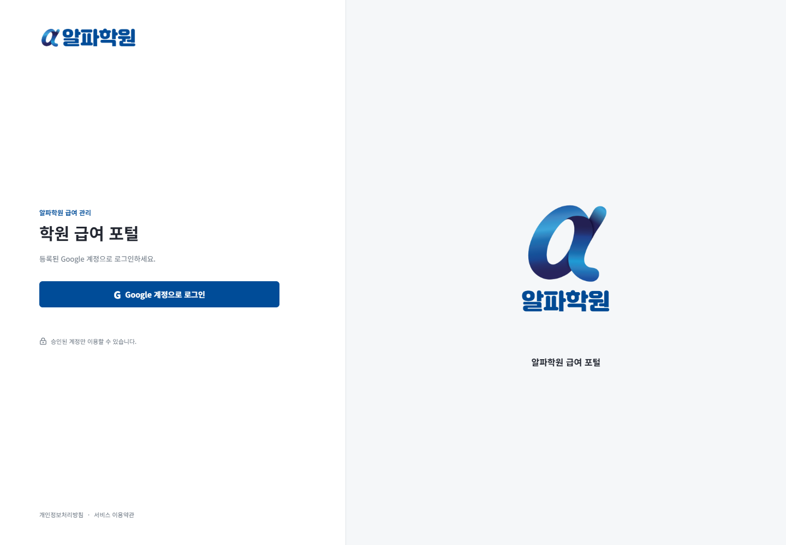

실제 입력값은 계약 자료와 대조합니다. 오류 화면을 공유할 때는 이름, 이메일, 급여액 등 개인정보를 먼저 가립니다.

## 2. 선생님 등록과 계정 승인

1. 선생님에게 포털 링크를 보내 본인의 Google 계정으로 처음 로그인하도록 안내합니다.
2. `선생님 관리`의 `Google 계정 승인 요청`에서 요청자 이름과 Google 이메일을 확인합니다.
3. 선생님을 미리 등록하지 않았다면 `신규 선생님 계정 생성`을 선택해 승인합니다. 선생님 등록과 Google 계정 연결이 함께 완료됩니다.
4. 같은 이메일의 선생님을 미리 등록했다면 표시된 기존 선생님과 연결합니다. 비활성 또는 이미 연결된 같은 이메일이 있으면 신규 계정을 중복 생성하지 말고 기존 정보를 먼저 확인합니다.
5. 승인된 선생님은 다시 로그인해 `등록 정보 > 내 정보 수정`에서 개인정보, 보험 가입 여부와 시급·약정 비율을 입력합니다. 이름은 한글 또는 영문과 단어 사이 공백만 입력합니다. 휴대전화는 고정된 `010` 뒤의 숫자 8자리만 입력하고, 생년월일은 자리별 숫자칸에 입력합니다.
6. 등록하지 않을 계정이나 잘못된 요청은 `반려`를 누르고 확인합니다. 반려된 요청은 대기 목록에서 사라지지만, 해당 계정이 다시 로그인하면 새 요청 시각의 대기 요청으로 다시 표시됩니다.
7. 확정 급여와 급여명세서 기록이 없는 선생님은 상세 화면의 삭제 버튼에서 등록 이메일을 다시 입력해 삭제할 수 있습니다. 수업시간·미확정 급여 입력만 있으면 해당 기록을 함께 정리하고 삭제합니다. 확정 급여, 명세서 발행·열람·발송 기록이 있거나 퇴사한 선생님은 과거 자료 보존을 위해 삭제하지 않고 비활성화합니다.

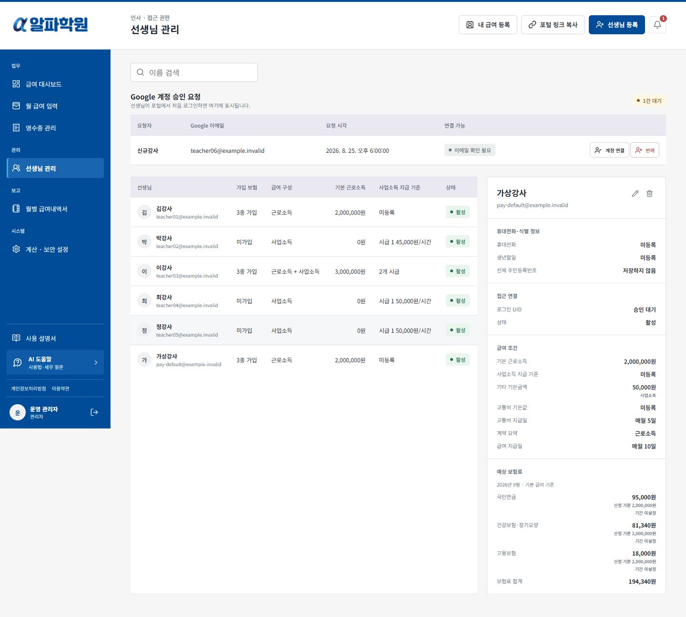

## 2-1. 관리자도 급여를 받는 경우

1. 급여를 받을 관리자 본인이 기존 Google 계정으로 로그인하고 `선생님 관리 > 내 급여 등록`을 누릅니다. 다른 계정이나 UID를 준비할 필요가 없습니다.
2. 같은 이메일로 미리 등록한 선생님이 있으면 해당 정보를 선택해 `연결`합니다. 없으면 `급여 대상 이름`을 확인하고 `등록하고 연결`을 누릅니다. 이미 다른 계정과 연결됐거나 비활성인 정보는 먼저 확인합니다.
3. `내 급여 등록 정보`에서 월급·시급·비율 등 계약 조건을 입력합니다. 관리 업무의 급여 대상 목록에도 본인이 포함됩니다.
4. 왼쪽 메뉴 위의 `내 급여`를 선택하면 본인 수업 내역, 영수증 제출, 발행된 급여명세서와 등록 정보를 확인할 수 있습니다. `관리 업무`를 선택하면 전체 급여 관리로 돌아옵니다. 다시 로그인하면 관리 업무 화면부터 열립니다.
5. 비활성화는 본인 급여 대상과 선생님 업무만 중단하며 관리자 로그인은 유지됩니다. 확정 기록이 없는 선생님 정보를 삭제해도 관리자 계정은 남습니다. 확정된 과거 자료의 삭제 제한은 동일합니다.

화면 전환은 Google 계정을 바꾸거나 관리자 권한을 내려놓는 기능이 아닙니다. 관리자 화면에서는 기존과 같이 전체 자료와 본인 급여를 관리할 수 있습니다. 각 관리자가 본인 계정으로 한 번씩 연결하면 됩니다.

## 3. 선생님 정보와 수업 내역 직접 입력

선생님은 `등록 정보 > 내 정보 수정`에서 이름, 휴대전화, 생년월일, 국민연금·건강보험·고용보험 가입 여부와 사업소득 시급·약정 비율을 직접 저장할 수 있습니다. 이름에는 한글 또는 영문과 단어 사이 공백을 입력합니다. 휴대전화와 생년월일에는 숫자만 입력하며, 입력칸을 채우면 다음 칸으로 이동합니다. 전체 주민등록번호는 입력하지 않습니다.

강사료 계산 방식은 시급 하나면 `시급`, 비율만 받으면 `비율`, 여러 시급 또는 시급과 비율을 함께 받으면 `혼합`을 선택합니다. 혼합에서 비율도 적용하려면 `수업 전체 학원비 비율 포함`을 체크하고 약정 비율과 시급을 등록합니다.

Google 이메일, 계정 상태, 근로소득 월급, 보험별 신고 기준액·적용 기간, 지급일, 세금과 공제 정보는 관리자만 확인·수정합니다. 선생님이 입력한 보험과 시급도 관리자가 계약 및 신고 자료와 비교해 최종 검토합니다.

1. `수업 내역 입력`에서 대상 월을 선택합니다. 관리자 겸 선생님은 먼저 왼쪽 메뉴의 `내 급여`로 전환합니다.
2. 등록된 근로소득 수업시간과 시급 항목별 사업소득 수업시간을 입력합니다.
3. 비율제 수업은 `해당 수업 전체 학원비`에 그 달의 정산 대상 총액을 입력합니다. 학생 수와 1인당 학원비는 입력하지 않습니다.
4. 전체 학원비를 아직 모르면 입력칸을 비우고 저장할 수 있습니다. 이후 관리자가 월 급여 입력에서 보완해야 급여를 확정할 수 있습니다.
5. 저장하면 관리자에게 제출 알림이 생성됩니다. 관리자는 제출 시간과 학원비를 검토·수정한 뒤 급여를 확정합니다.

급여가 확정된 월은 먼저 확정 취소 절차를 거치기 전에는 수업 내역을 수정할 수 없습니다.

## 3-1. 교통비·주차비 영수증 제출과 승인

1. 선생님은 `영수증 제출`에서 귀속 월, 사용 날짜, 금액과 파일을 입력합니다. 주차비 영수증도 `교통비 (주차비 포함)`로 제출합니다.
2. JPG, PNG, WebP 또는 PDF 파일을 제출할 수 있으며 최종 파일은 5MB 이하여야 합니다. 휴대전화 사진은 전송 전에 자동 축소됩니다.
3. 제출하면 관리자 상단의 종 아이콘에 영수증 알림이 표시됩니다.
4. 관리자는 `영수증 관리`에서 파일과 금액을 확인하고 회계 처리 방식을 선택해 승인하거나 반려합니다.
5. 승인된 교통비와 기존 주차비는 해당 월의 교통비 합계에 자동 합산됩니다. 관리자가 월 급여 입력에서 직접 적은 금액과 영수증 승인액은 별도로 계산하므로 중복 입력하지 않습니다.
6. 승인 후 선생님은 상태와 금액만 확인하고 파일은 다시 열 수 없습니다. 반려된 영수증은 반려 사유를 확인한 뒤 새 파일로 다시 제출합니다.

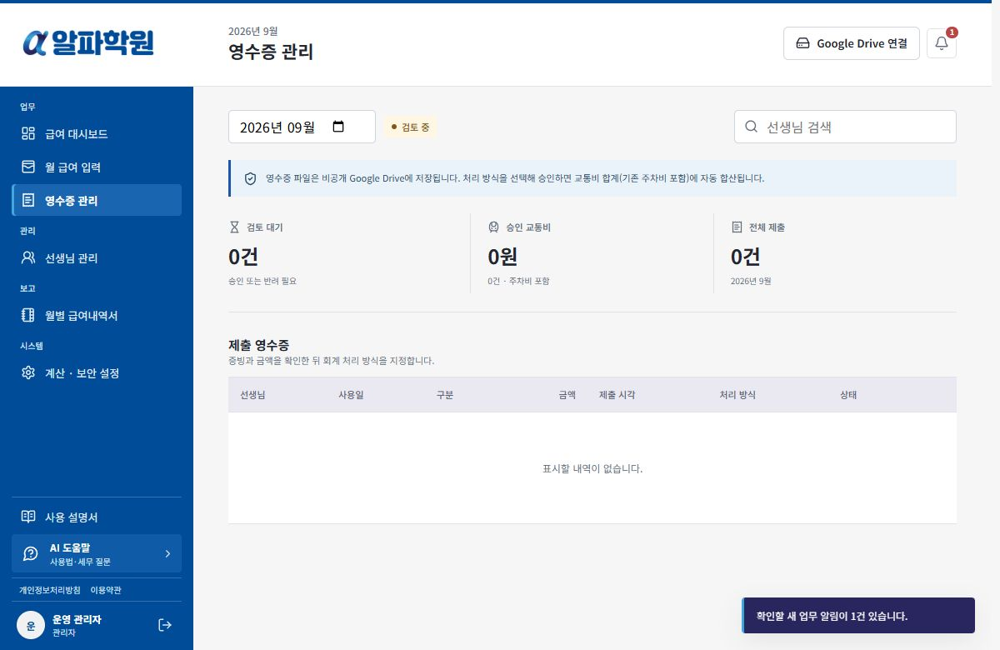

승인된 영수증의 원본은 관리자만 열람합니다. 급여가 확정된 월은 영수증 제출·승인·삭제가 잠기므로 정정이 필요하면 먼저 확정 취소 절차를 진행합니다.

## 4. 보험·근로소득 월급·사업소득 지급 방식

`계약 요약`을 먼저 선택하면 선택한 소득 유형에 필요한 영역만 열립니다. 근로소득 또는 혼합형에서는 기본 근로소득 월 지급액을 1원 단위로 입력합니다. 국민연금, 건강보험·장기요양, 고용보험 가입 항목을 선택하면 `예상 보험료`와 예상 소득세·지방소득세가 표시됩니다. 선생님 관리 상세에서도 선택된 급여월의 기본 급여 기준 보험료와 합계를 확인할 수 있습니다. 별도로 저장된 신고 기준액은 유지하며, 자동 연동되는 기준액만 월 지급액에 맞춰 갱신합니다. 세 보험은 실제 가입 상태와 적용 기간에 맞게 따로 관리합니다. 산재보험은 사업주 부담이므로 근로자 공제액에는 포함하지 않습니다. 실제 공단 고지액과 다른 공제액은 급여 확정 전 `과세·공제 조정`에서 월별로 맞춥니다.

`공통 지급 설정`의 `기타 기본금액`은 매월 기본 지급액에 포함됩니다. 금액과 과세 처리를 입력하며 보험 신고 기준 포함 체크박스는 표시하지 않습니다. 기존에 저장된 보험 적용 설정은 유지됩니다. 월 급여 입력에 이미 저장한 기타 항목이나 엑셀 직접 입력이 있으면 그 월의 값이 우선하며, 기타 항목을 모두 지우고 저장하면 그 월은 0원으로 처리됩니다. 엑셀 J열에는 교통비와 주차비 합계, K열에는 기타비만 표시됩니다.

`교통비 지급일` 기본값은 **매월 5일**이며 `급여 지급일`과 별도로 관리합니다. 지급 예정일을 기록하는 항목으로 자동 이체 기능은 아닙니다. 기존 급여 지급일은 변경하지 않습니다.

숫자 입력칸 위에서 스크롤해도 금액은 바뀌지 않습니다. 입력값을 수정해도 이미 발행한 명세서는 자동 변경되지 않으므로, 확정본의 금액을 정정하려면 확정 취소 사유를 남기고 다시 검토한 뒤 재발행합니다.

사업소득이 있으면 강사료 계산 방식을 `시급 / 비율 / 혼합` 중 선택합니다. 시급 하나는 `시급`, 해당 수업 전체 학원비의 비율만 받으면 `비율`, 여러 시급 또는 시급과 비율을 함께 받으면 `혼합`입니다.

`계약 요약`의 **근로소득 + 사업소득**은 두 소득을 함께 받는다는 뜻이고, `강사료 계산 방식`의 **혼합**은 여러 시급이나 시급과 비율을 함께 계산한다는 뜻입니다. 서로 다른 설정이며 소득 구분은 계약과 실제 업무 관계에 맞게 확인합니다.

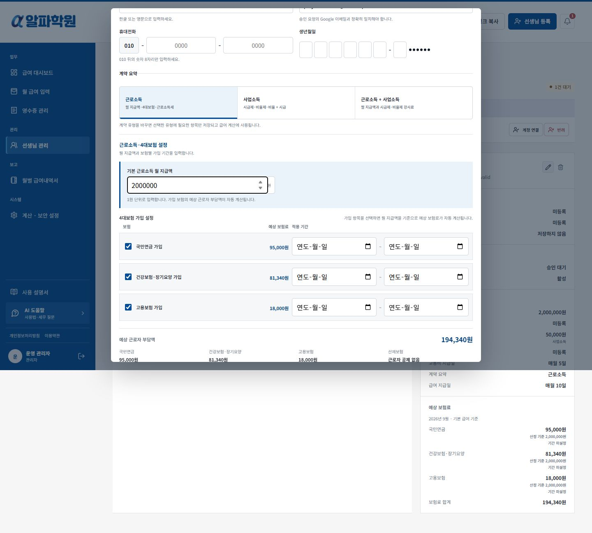

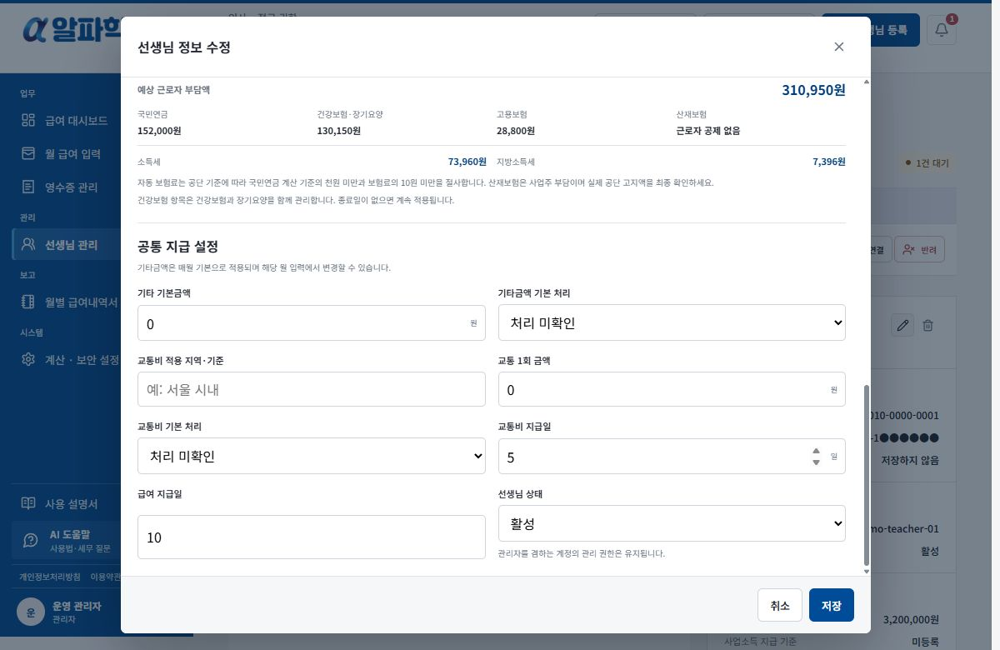

### 수업 전체 학원비 비율제

비율제 강사료는 **해당 수업 전체 학원비 × 약정 비율**입니다. 학원 전체 매출이나 학생 수와 1인당 단가를 곱한 값이 아니라, 해당 수업의 월별 정산 대상 학원비 총액을 직접 입력합니다.

1. `선생님 관리 > 정보 수정 > 강사료 계산 방식`에서 `시급 / 비율 / 혼합` 중 하나를 선택합니다. 시급 하나는 `시급`, 비율만 받으면 `비율`, 여러 시급 또는 시급과 비율을 함께 받으면 `혼합`입니다.
2. 혼합에서 `수업 전체 학원비 비율 포함`을 체크하면 약정 비율 하나와 최대 9개 시급을 함께 적용합니다. 체크하지 않으면 최대 10개 시급만 계산합니다. 근로소득·사업소득 구분은 이 계산 방식과 별도로 유지합니다.
3. 비율제의 `약정 비율`에 예를 들어 `40`을 입력하고 저장합니다. 비율은 0 초과 100 이하이며 소수점 둘째 자리까지 입력합니다. 이 단계에서는 월 학원비가 없어도 등록할 수 있습니다.
4. 선생님은 `수업 내역 입력`에서 대상 월의 `해당 수업 전체 학원비`를 입력합니다. 아직 모르면 비워 저장하고 관리자가 나중에 입력하도록 할 수 있습니다.
5. 관리자는 `월 급여 입력`에서 해당 선생님의 수정 버튼을 눌러 제출 내용을 확인하거나 직접 입력합니다. 환불·할인 등은 계약상 정산 기준에 따라 총액에 반영하고, 비율 정산 대상이 아닌 수업은 포함하지 않습니다.
6. 해당 수업 전체 학원비가 `5,000,000원`이면 40% 적용 강사료는 `2,000,000원`이며 원 미만은 반올림합니다. 시급 5만 원의 수업 10시간도 있으면 강사료 합계는 `2,500,000원`입니다.
7. 미입력은 `학원비 입력 대기`로 표시되고 급여 확정이 차단됩니다. 정산 대상 학원비가 없는 달은 전체 학원비에 `0`을 입력해 0원 정산임을 확인합니다.
8. 관리자가 저장한 전체 학원비·월별 비율은 선생님 재제출로 덮어쓰지 않습니다. 새 제출값과 다르면 관리자가 `선생님 제출값 반영`으로 선택해 반영하고 저장합니다.
9. 명세서와 CSV의 `강사료 산정 기준`에는 해당 수업 전체 학원비·적용 비율이 표시됩니다. 비율제 금액을 수업시간으로 환산하지 않습니다.

비율제 선생님도 `등록 정보`에서 약정 비율을 확인·입력할 수 있으며 관리자가 최종 검토합니다. 근로소득 월급이나 시급제 수업도 있으면 `수업 내역 입력`에서 해당 수업시간도 함께 제출합니다. 기존 학생 수 방식의 입력은 합계로 표시하고 다시 저장하면 총액 방식으로 기록합니다. 이미 발행한 명세서의 금액과 과거 산정 근거는 변경하지 않습니다.

시급제와 비율제를 전환한 뒤에는 미확정 월의 지급액을 다시 검토합니다. 이전 방식의 계약 항목은 중복 합산하지 않으며 원본 입력과 이미 발행한 명세서는 삭제하지 않습니다. 관리자가 월별로 별도 추가한 시급 항목은 추가 지급으로 남으므로 계약에 맞는지 확인합니다. 지급 방식 변경만으로 실제 소득 구분을 판단하지 않으며, 이 기능은 기존 사업소득 강사료의 계산 방식을 확장한 것입니다.

## 5. 월 급여 입력

1. `월 급여 입력`에서 급여월을 선택합니다.
2. 상단 종 아이콘에서 수업시간 제출 알림은 해당 선생님의 월 지급액 입력 창을, 영수증 제출 알림은 해당 영수증 검토 창을 엽니다.
3. 각 선생님의 보험별 가입·신고 기준액, 기본 근로소득과 등록된 사업소득 시급·약정 비율을 확인합니다.
4. 선생님 행의 연필 버튼을 눌러 제출된 수업시간과 해당 수업 전체 학원비를 확인하고 누락이나 오류를 수정합니다. 관리자가 저장한 학원비는 선생님 재제출로 덮어쓰지 않으며, 필요한 경우 `선생님 제출값 반영`을 누르고 저장합니다.
5. 국민연금·건강보험·고용보험의 이번 달 신고 기준액을 각각 확인합니다.
6. 교통비는 주차비를 포함해 지급 횟수와 1회 금액으로 입력합니다. 월 합계로 입력하려면 횟수를 1로 두고 합계 금액을 입력합니다. 기타 지급은 별도 항목으로 입력합니다. 승인 영수증 금액과 이전에 저장한 주차비는 자동 합산되므로 다시 입력하지 않습니다.
7. 교통비·기타 지급마다 `사업소득 3.3%`, `근로소득 과세`, `비과세 실비`, `기타소득` 중 세무사가 확인한 처리를 선택합니다. 이전 주차비가 남아 있으면 `이전 주차비 내역`에서 과세 처리만 확인할 수 있습니다. 아직 확인 전이면 `처리 미확인`으로 두되 급여를 확정할 수는 없습니다.
8. 화면에서 `시급 × 수업 시수`와 `해당 수업 전체 학원비 × 약정 비율`, 강사료 총액과 예상 공제를 확인합니다. 학원비가 비어 있으면 입력 대기이므로 확정 전에 보완합니다.
9. 보험 가입 선생님의 근로소득 월급이 빠지지 않았는지 확인합니다.

시급제 사업소득은 입력한 수업 시수를, 비율제 사업소득은 해당 수업 전체 학원비와 약정 비율을 사용합니다. 혼합에서 비율을 포함하면 두 계산액을 합산합니다. 근로소득 월급에는 수업 여부가 영향을 주지 않습니다. 보험 가입자는 수업이 없어도 기본 월급이 자동 적용됩니다.

급여가 확정된 월은 잠기며, 수정하려면 먼저 확정 취소 사유를 기록해야 합니다.

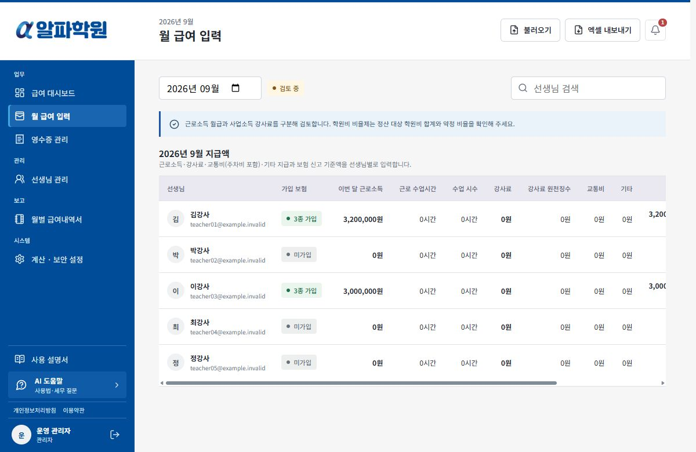

### 엑셀 불러오기·내보내기

1. `월 급여 입력`에서 반영할 월을 먼저 선택하고 `불러오기`를 누릅니다. 확정된 월은 가져올 수 없습니다.
2. 강사료 양식의 `.xlsx` 파일(5MB 이하, 한 번에 300명 이하)을 선택하고 급여 시트를 고릅니다. 파일명·시트 제목이 서로 다른 월이어도 **화면에서 선택한 급여월**에 반영하므로 반드시 확인합니다.
3. `변경 내역 확인`에서 이름·연락처로 연결된 선생님을 확인합니다. 일치하지 않거나 중복이면 직접 선택합니다. 새 선생님을 자동 등록하지 않습니다.
4. G열 강사료는 근로소득 월급과 사업소득 강사료의 합계입니다. 혼합 소득 선생님은 근로소득 금액과 시간을 입력하고 나머지를 사업소득으로 배분하는 확인란을 선택합니다.
5. H열은 강사료 원천징수 합계, L열은 교통비·기타 지급의 별도 원천징수 합계입니다. R·S열은 근로소득세·지방소득세, T~W열은 보험별 공제액입니다. H·L을 임의로 소득세·지방세로 쪼개지 않고 직접 입력 공제로 표시합니다. 혼합 소득의 L열 공제는 어느 명세서에 반영할지 선택합니다.
6. J열 교통비는 교통비와 주차비 합계이며 승인 영수증 금액도 포함합니다. 불러올 때 기존 주차비와 승인된 교통비 영수증은 유지하고 나머지를 직접 입력 교통비로 반영합니다. 이 합계보다 작은 금액은 반영하지 않습니다. K열 기타는 기타비만 반영합니다. 교통비·기타 지급의 소득 구분도 확인합니다. 이전에 내보낸 파일에 `K 기타 = 주차비 + 기타 지급` 표기가 남아 있으면 해당 파일만 이전 합산 방식으로 읽습니다.
7. 기존·적용 후·산정 기준 계산 금액과 `항목별 변경 전후`를 확인하고 반영할 선생님만 선택합니다. 빈칸은 기존 값 유지, `0`은 명시적인 0원 입력입니다. E·M·X열은 합계 비교용이며 지급이나 공제에 중복 합산하지 않습니다. 합계가 다르면 차이 확인란을 추가로 선택합니다.
8. 반영된 금액은 `엑셀 직접 입력`으로 표시됩니다. 기존 시급·비율제 산정 근거와 선생님 제출값은 보존됩니다. 연필 버튼에서 직접 입력 금액을 수정하거나 `엑셀 직접 입력을 모두 해제하고 기존 산정값으로 복원`을 선택할 수 있습니다. 확정·공개·메일 발송은 자동 실행되지 않습니다.
9. `엑셀 내보내기`는 미확정 월의 활성 선생님 전체를 원본과 같은 A~X열 형식으로 저장합니다. 사이트와 엑셀 모두 교통비에 주차비를 합산하며, 엑셀 J열은 교통비 합계, K열은 기타비만 넣습니다. 확정된 월은 이후 비활성화된 선생님도 포함해 당시 확정 명세서의 금액을 내보냅니다. 검색 필터와 관계없이 전체가 포함됩니다. 개인정보 열인 주민등록번호·주소·은행·계좌번호는 불러오지 않고 내보낼 때도 빈칸입니다.

원본 형식에는 시급별 시간, 비율제 학원비 근거, 소득 배분, 별도 주차비와 기타 공제 칸이 없습니다. 이 엑셀은 전체 데이터 백업이 아니며, 다른 월에 다시 가져올 때 배분·주차비·기타 공제를 별도로 확인해야 합니다. 기타 공제는 비고에 표시하고 실제 지급액에는 포함합니다. 수식은 실행하지 않고 파일에 저장된 계산 결과만 읽습니다. 계산 결과가 없으면 엑셀에서 다시 계산하고 저장해 주세요.

세금·보험료 칸이 비어 있으면 기존 직접 입력값은 유지하고, 자동 공제는 새 지급액과 기존 정책으로 재계산합니다. 자동 계산 결과를 고정하려면 해당 공제 칸에 금액을 입력합니다.

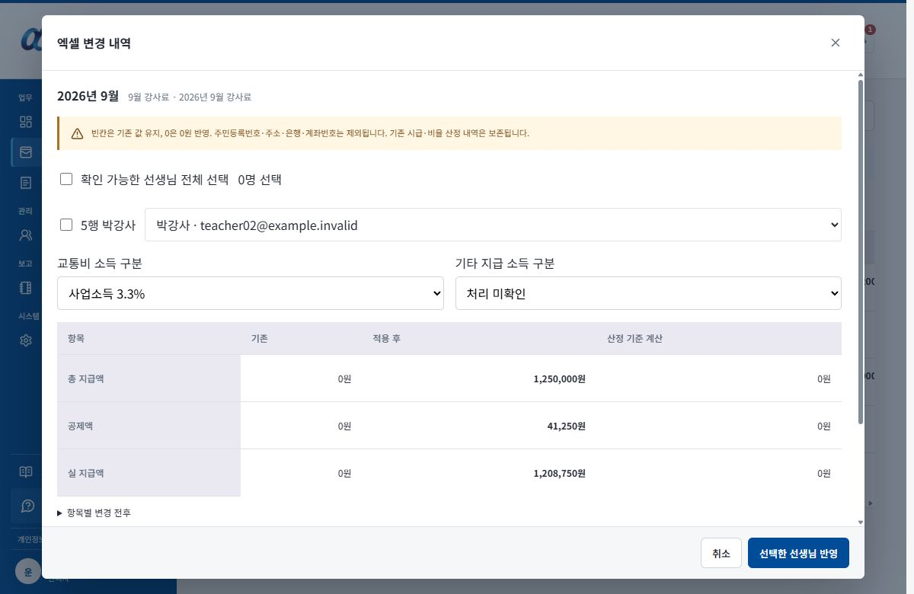

## 6. 급여 계산과 공제

`급여 대시보드` 상단 요약은 **선생님 수, 총 지급액, 실 지급액** 세 항목입니다. 선생님 수 영역은 좁고 두 금액 영역은 넓게 표시됩니다. **총 공제액은 아래 선생님별 급여 표**에서 확인합니다.

미확정 월의 선생님 행에서 계산기 아이콘인 `과세·공제 조정`을 열 수 있습니다. 자동 사회보험료는 예상값이므로 공단 고지액, 입·퇴사월, 두루누리, 휴직과 정산 내역을 확인한 뒤 국민연금, 건강보험+장기요양 합계, 고용보험의 수동 공제액으로 맞춥니다.

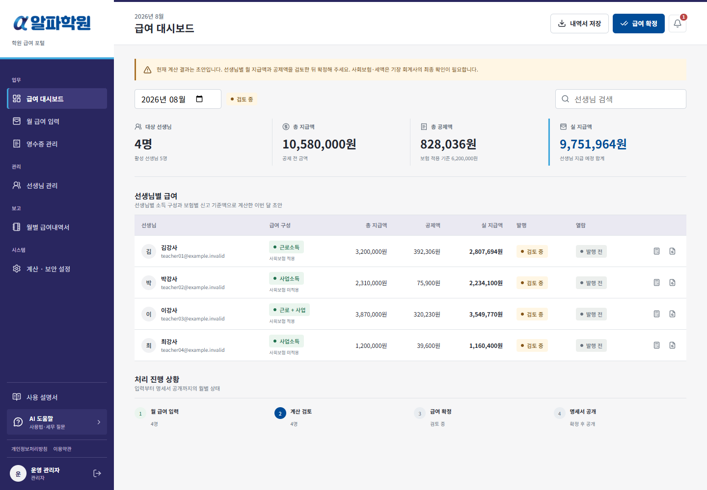

## 7. 급여 확정·취소·재발행

1. 회계사 검토가 끝나면 `급여 확정`을 누릅니다.
2. 확정 즉시 현재 명세서가 선생님에게 공개됩니다.
3. 오류가 있으면 `확정 취소`에서 개인정보 없는 사유를 기록합니다.
4. 월 지급액 또는 공제액을 수정한 뒤 `수정본 재발행`을 누릅니다.
5. 이전 차수와 취소 이력은 관리자 기록에 보존됩니다.

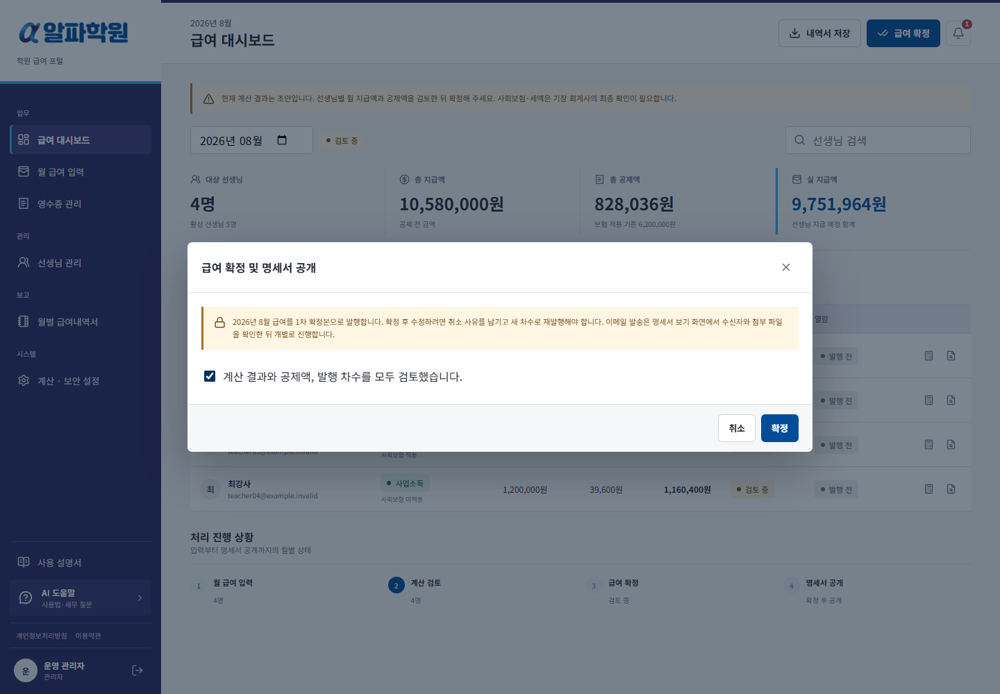

## 8. 개인 급여명세서 출력과 이메일

1. `급여 대시보드`에서 급여월을 선택합니다.
2. 선생님별 급여 표 맨 오른쪽의 `명세서 보기` 아이콘을 누릅니다.
3. 근로소득과 사업소득을 함께 받는 선생님은 같은 달에 `근로소득 명세서`와 `사업소득 명세서`가 따로 표시됩니다.
4. 보낼 명세서를 선택한 뒤 `PDF 다운로드`, `인쇄` 또는 `이메일 발송`을 사용합니다. 파일명과 이메일 제목에도 소득 구분이 표시됩니다.
5. 두 명세서를 모두 보내려면 각각 선택해 두 번 발송합니다. 열람·발송 이력도 명세서별로 기록됩니다.
6. `Gmail로 발송`을 누르면 현재 로그인한 관리자 Google 계정에 Gmail 전송 권한만 요청합니다. 수신자, 금액, 공제 내역과 첨부 파일을 확인한 뒤 개별 발송합니다.
7. PDF 첨부가 필요하지만 Gmail API를 사용하지 않으면 `PDF 저장 후 메일 앱 열기`로 직접 첨부합니다.

명세서 본문에는 `발행 상태`를 표시하지 않습니다. 고정 월급·고정 지급액만 있으면 지급 내역의 `산정 기준` 열도 생략합니다. 시급·횟수·비율로 계산하는 항목이 있으면 계산 근거를 확인할 수 있도록 이 열을 유지합니다. 화면과 PDF·인쇄·이메일 첨부에 같은 형식을 사용하며, 미확정 명세서는 제목에 `미리보기`를 표시합니다. 발행·취소·재발행 이력은 그대로 보존됩니다.

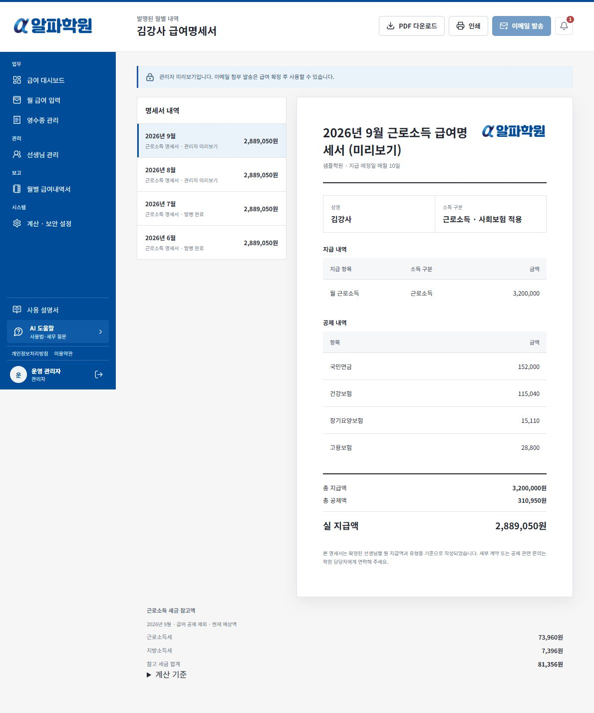

대시보드 첫 화면에는 일괄 발송 버튼이 없습니다. 이미 발송한 명세서도 `명세서 보기 > 이메일 발송`에서 다시 발송할 수 있습니다. 선생님은 본인 계정의 `급여명세서`에서 현재 확정된 명세서를 확인합니다.

## 9. 월별 급여내역서

`월별 급여내역서`에서 소득 구분, 총 지급액(신고액), 실 지급액, 수업시간, 강사료와 3.3%, 교통 횟수·교통비(주차비 포함)·기타, 근로소득세·지방소득세, 건강+요양·국민연금·고용보험과 각 신고 기준액을 확인합니다. 근로소득과 사업소득을 함께 받는 선생님은 같은 달에 소득 구분별 두 줄로 표시되며, CSV에도 두 줄로 저장됩니다.

비율제·혼합형의 `강사료 산정 기준`에는 해당 수업 전체 학원비, 적용 비율과 시급 내역이 표시되고 CSV에도 포함됩니다.

`교통·기타 원천징수`는 강사료 외 교통비(기존 주차비 포함)·기타 지급을 사업소득 또는 기타소득으로 처리하면서 공제한 세금입니다. 해당 지급이 비과세 실비로 확인되면 이 칸은 0원이며, 실제 과세 여부는 세무사 확인 결과에 따라 월 급여 입력에서 처리 방법을 선택합니다.

CSV에는 회계 확인용 생년월일 식별값이 포함되지만 전체 주민등록번호는 없습니다. CSV도 개인정보 문서이므로 회계사와 합의한 안전한 채널로만 전달하고 공개 링크로 공유하지 않습니다.

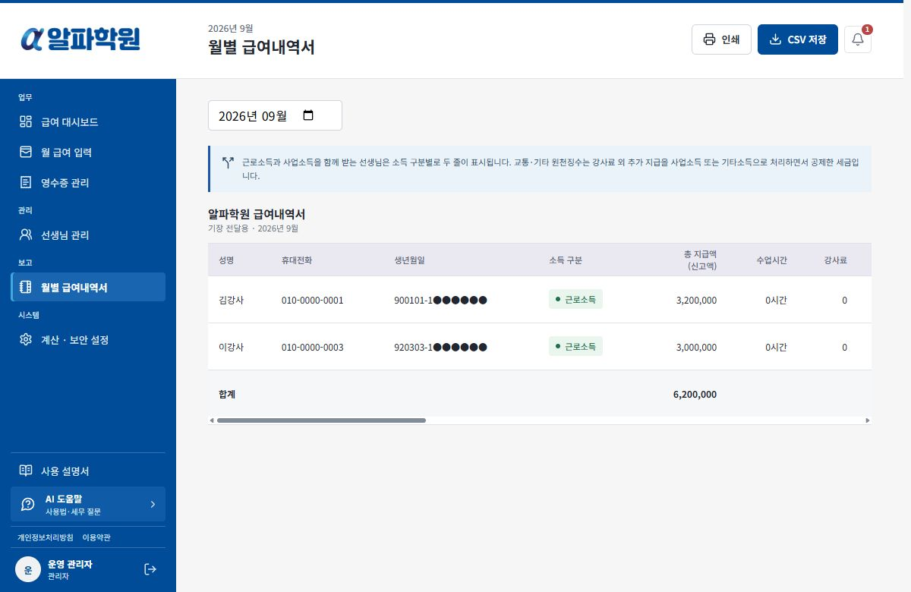

## 10. 계산·보안 설정

세금과 사회보험 기준이 바뀌면 과거 버전을 수정하지 않고 새 시행일의 버전을 추가합니다. 공식 근거와 현재 적용 버전을 함께 확인합니다.

월 지급액과 보험별 신고 기준액은 1원 단위로 입력할 수 있습니다. 자동 계산에서는 국민연금 기준소득월액의 천원 미만을 먼저 버리고, 국민연금·건강보험·장기요양·고용보험 공제액의 10원 미만을 버립니다. 공단 고지액을 수동으로 조정할 때는 1원 단위 입력값이 그대로 적용됩니다.

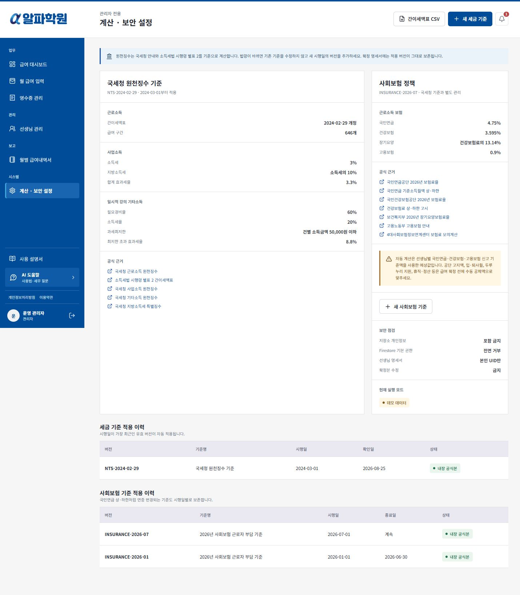

## 11. AI 도움말

관리자 화면 왼쪽 아래의 `AI 도움말`을 누르면 어느 탭에서든 프로그램 사용법과 회계·세무 검토 항목을 질문할 수 있습니다. 이 기능과 관리자 사용 설명서는 선생님 화면에 표시되지 않으며, 선생님 역할로는 실행할 수 없습니다. Gemini가 설정되기 전에도 내장 설명서를 검색해 답합니다.

세무 질문은 실제 이름, 이메일, 휴대전화 번호, 주민등록번호, 생년월일 식별값과 계좌번호를 빼고 질문합니다. 금액이 필요하면 `근로소득 월 300만원, 사업소득 월 100만원`처럼 개인을 식별할 수 없는 반올림한 가상 사례를 사용합니다. AI는 저장된 선생님·급여 자료를 자동으로 읽지 않습니다.

AI 도움말은 근로소득·사업소득·혼합소득의 신고 흐름, 원천징수와 최종세액의 차이, 근로소득 공제, 사업소득 필요경비와 증빙, 회계사에게 확인할 항목을 정리할 수 있습니다. 인적용역 사업소득의 3.3% 원천징수는 최종세액이 아니며, 근로소득과 신고대상 사업소득이 함께 있으면 종합소득세 합산 신고 여부를 확인해야 합니다.

소득 구분은 세금을 줄이기 위해 임의로 선택하지 않고 실제 고용관계와 업무 실질에 따라 판단합니다. AI는 소득 누락, 허위 계약, 가공 경비·영수증, 명의 분산, 지급 쪼개기 같은 위법한 방법을 안내하지 않습니다. 답변은 참고용 검토 목록이며 확정 신고·세액 계산을 대신하지 않으므로 적용 연도와 개인별 사실관계는 기장 회계사·세무사·노무사 또는 국세청 126에 확인합니다.

공식 근거:

- 국세청 사업소득 안내: `https://www.nts.go.kr/nts/cm/cntnts/cntntsView.do?cntntsId=7900&mi=6620`
- 국세청 종합소득세 확정신고 안내: `https://www.nts.go.kr/nts/cm/cntnts/cntntsView.do?cntntsId=238978&mi=4048`
- 국가법령정보센터 소득세법 제127조: `https://www.law.go.kr/법령/소득세법/제127조`
- 국세청 국세상담센터 126: `https://s.nts.go.kr/nts/cm/cntnts/cntntsView.do?cntntsId=7848&mi=13364`

챗봇은 데이터를 수정, 확정, 신고 또는 발송하는 작업을 직접 수행하지 않습니다.

## 12. 문제 해결

- 로그인이 안 되면 관리자에게 Google 로그인 설정 점검을 요청합니다.
- 승인 요청이 연결되지 않으면 같은 이메일의 비활성 또는 이미 연결된 선생님이 있는지 확인합니다.
- 관리자에게 `내 급여` 전환이 표시되지 않으면 `선생님 관리 > 내 급여 등록`을 완료했는지, 연결된 선생님 정보가 활성 상태인지 확인합니다.
- `학원비 입력 대기`로 급여 확정이 막히면 해당 수업 전체 학원비를 입력합니다. 정산 대상 학원비가 없는 달은 `0`을 입력하고 저장합니다.
- 명세서가 보이지 않으면 대상 월의 급여 확정 상태를 확인합니다.
- 이메일 버튼이 비활성화되면 급여가 확정됐는지 확인합니다.
- Gmail 발송 오류가 발생하면 관리자 Gmail 연결 상태를 확인하거나 PDF 직접 첨부 방식을 사용합니다.
- 앱 오류는 자동으로 사라지는 알림이 아니라 확인 버튼을 누를 때까지 남는 팝업으로 표시됩니다. 오류 문구를 닫기 전에 캡처하면 원인 확인에 도움이 됩니다.

## 13. 개인정보처리방침과 서비스 이용약관

로그인 전에는 Google 로그인 버튼 아래에서 `개인정보처리방침`과 `서비스 이용약관`을 열 수 있습니다. 로그인 후에는 관리자와 선생님 모두 왼쪽 사이드바 아래의 정책 링크에서 같은 문서를 확인할 수 있습니다.

- 공개 개인정보처리방침: `https://payroll.robertson.kr/privacy.html`
- 공개 서비스 이용약관: `https://payroll.robertson.kr/terms.html`

개인정보처리방침에는 Google 로그인 UID·이메일·표시 이름, 관리자 전용 Gmail 발송 권한, 관리자 전용 Gemini 도움말, 외부 서비스 처리 범위와 Google 권한 철회 방법이 포함되어 있습니다. 서비스 이용약관에는 관리자·선생님의 계정 및 입력 책임, 자동 급여 계산의 한계와 외부 서비스 이용 조건이 포함되어 있습니다.

포털을 실제로 운영하는 학원이 개인정보처리자입니다. 운영 전에는 정책 페이지의 `소속 학원`과 `급여 관리자` 표현을 실제 학원 상호, 개인정보 보호 담당자와 연락처로 바꾸고 근로계약·급여 안내 내용과 일치하는지 확인합니다.

